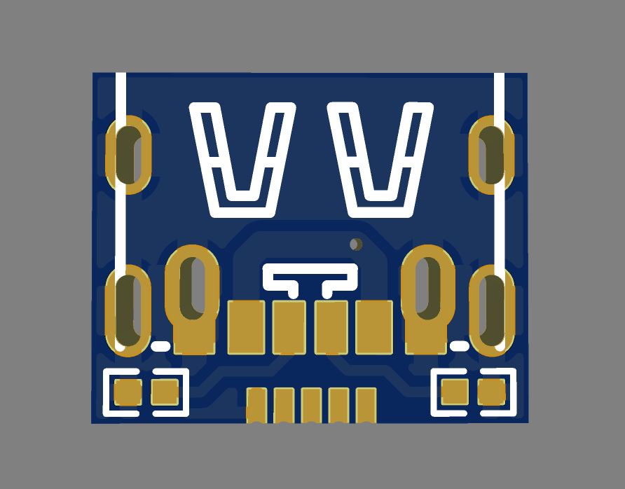
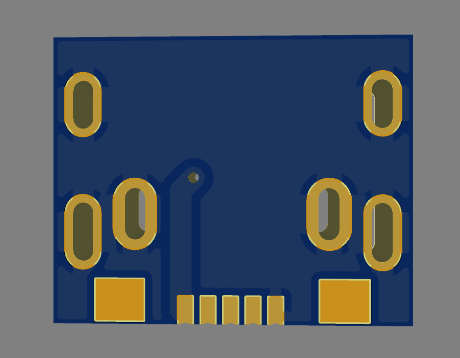

# Micro-Usb-To-C-Solder-On-Board
This is Microusb to type-c board for the purpose of soldering onto a micro usb footprint. This should simplify the conversion of existing micro usb devices into usb type c.

Features:
- Usb 2.0
- Usb C to Usb C compatible
- Small and Easy to solder.

Credits:

https://www.fiverr.com/vortex968 (Commissioned)

*Gerber File is a 20x20mm baord with cut-out for smt assembly. Below is representation of finished with excess removed.

| Top View | Bottom  View |
| --- | ---|
|  | 
 |
